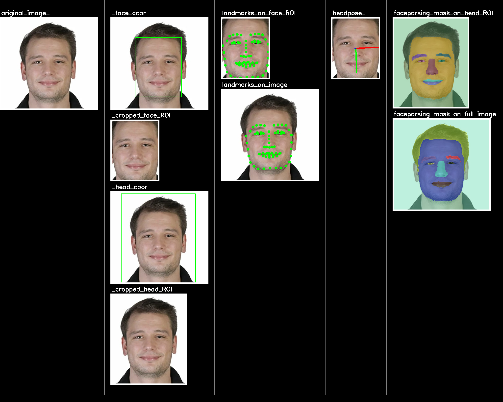

# FaceXFormer Pipeline Implementation


This repository contains an easy-to-use pipeline implementation of the FaceXFormer, a unified transformer model for comprehensive facial analysis, as described in the paper by Kartik Narayan et al. from Johns Hopkins University.

Here is the official code repository: [FaceXFormer Official Repository](https://github.com/Kartik-3004/facexformer)

## What Does This Implementation Do Differently?

The official implementation is excellent as it primarily focuses on benchmarking. However, it is not yet application-ready. With this implementation:

- No need to deal with reverse transforms, resizing, or remapping to the original image size.
- Cropping is being handled internally (different crops are used for face parsing and landmarks for better accuracy).
- It is possible to run only one task or any combination of tasks.
- You can pass your own face detection method's coordinates as arguments and you are not forced to rerun the face detection calculations.
- Visual debugging is much easier thanks to the use of the `visual_debugger` package.
- Results are provided with all the extra information you may need.

---

## What is it 

You can use FaceXFormer to extract
- **faceparsing mask**
- **landmarks**
- **headpose orientation**
- **various attributes** 
- **visibility** 
- **age-gender-race** 

information really fast and from unified model.  And you can do it really fast (37 FPS).

## Installation
```bash
pip install facexformer_pipeline 
```

## Usage

To use the FaceXFormer pipeline, follow these steps:

```python
# Import the pipeline class
from facexformer_pipeline import FacexformerPipeline

# Initialize the pipeline with desired tasks
pipeline = FacexformerPipeline(debug=True, tasks=['headpose', 'landmark', 'faceparsing'])

# Put your code for reading an image 
# image_path = "sample_image_head_only.jpg"
# uih = UniversalImageInputHandler(image_path)   #  to use UniversalImageInputHandler you need "pip install image_input_handler"
# img = uih.img

# Run the model on an image
results = pipeline.run_model(img)

# Access the results from results dictionary
print(results['headpose'])
print(results['landmarks']) 
print(results['faceparsing_mask']) 


# Also you can access intermediate results such as face region crop, face coordinates etc
print(results['face_ROI'])
print(results['face_coordinates']) 
print(results['head_coordinates']) 


```

You can demonstrate the results really easily with visual_debugger
(These lines creates the above image)

```python

# Show the results on the image
from visual_debugger import VisualDebugger, Annotation, AnnotationType

vdebugger = VisualDebugger(tag="facex", debug_folder_path="./", active=True)

annotation_landmarks_face_ROI = [
    Annotation(type=AnnotationType.POINTS, coordinates=results["landmarks_face_ROI"], color=(0, 255, 0))
]
annotation_landmarks = [
    Annotation(type=AnnotationType.POINTS, coordinates=results["landmarks"], color=(0, 255, 0))
]
annotation_headpose = [
    Annotation(type=AnnotationType.PITCH_YAW_ROLL, orientation=results["headpose"], color=(0, 255, 0))
]
annotation_face_coordinates = [
    Annotation(type=AnnotationType.RECTANGLE, coordinates=results["face_coordinates"], color=(0, 255, 0))
]
annotation_head_coordinates = [
    Annotation(type=AnnotationType.RECTANGLE, coordinates=results["head_coordinates"], color=(0, 255, 0))
]
annotation_faceparsing = [
    Annotation(type=AnnotationType.MASK, mask=results["faceparsing_mask"], color=(0, 255, 0))
]
annotation_faceparsing_head_ROI = [
    Annotation(type=AnnotationType.MASK, mask=results["faceparsing_mask_head_ROI"], color=(0, 255, 0))
]

vdebugger.visual_debug(img, name="original_image")
vdebugger.visual_debug(img, annotation_face_coordinates, name="", stage_name="face_coor")
vdebugger.visual_debug(results["face_ROI"], name="", stage_name="cropped_face_ROI")
vdebugger.visual_debug(img, annotation_head_coordinates, name="", stage_name="head_coor")
vdebugger.visual_debug(results["head_ROI"], name="", stage_name="cropped_head_ROI")
vdebugger.visual_debug(results["face_ROI"], annotation_landmarks_face_ROI, name="landmarks", stage_name="on_face_ROI")
vdebugger.visual_debug(img, annotation_landmarks, name="landmarks", stage_name="on_image")
vdebugger.visual_debug(results["face_ROI"], annotation_headpose, name="headpose")
vdebugger.visual_debug(results["head_ROI"], annotation_faceparsing_head_ROI, name="faceparsing", stage_name="mask_on_head_ROI")
vdebugger.visual_debug(img, annotation_faceparsing, name="faceparsing", stage_name="mask_on_full_image")
vdebugger.cook_merged_img() # creates merged image
```

## Acknowledgements

This implementation is based on the research conducted by Kartik Narayan and his team at Johns Hopkins University. All credit for the conceptual model and its validation belongs to them.


